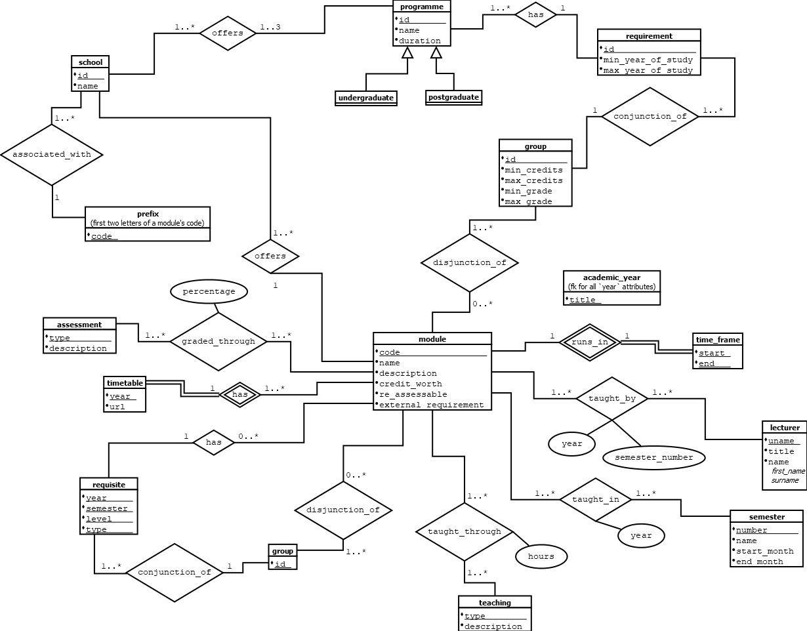
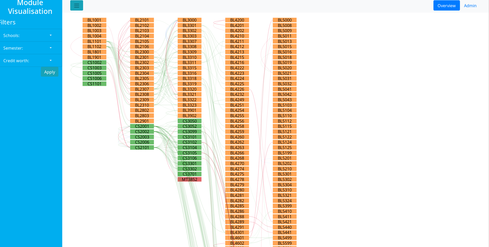
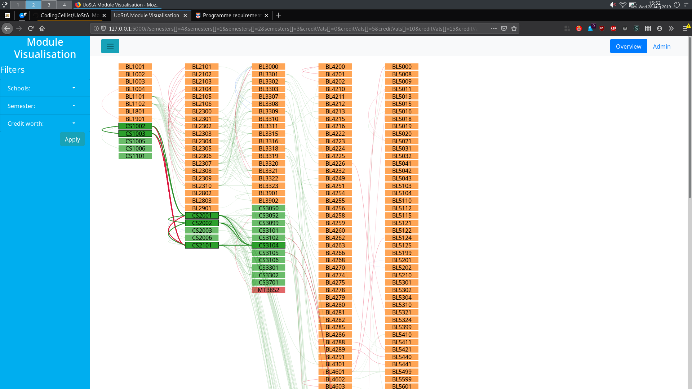

# UoStA Module Visualisation
Visualising the UG modules and requisites of the University of St Andrews.


# Project Structure
The top-level directory contains this README and the `.gitignore`. Apart from
that, the project is split into two main sub-directories:  
- `Database` -- contains all the files relevant to the database design,
  implementation, and data-population. Its sub-directories are:  
  - `dia` -- contains the raw `.dia`-files used for the ER-diagrams  
  - `initial-values` -- contains variuos SQL-scripts which populate the
    database with values that were easy to define/hardcode  
  - `initialisation-sql` -- contains the SQL-code used to create the tables,
    relations, and triggers of the database  
  - `non-schools` -- contains SQL-scripts for creating departments which
    technically no longer exist, but still offer modules  
  - `oddities` -- contains SQL-scripts to create various old or obscure modules
    that certain modern modules still reference for some reason  
  - `proc-tests` -- contains three little SQL-scripts which were manually coded,
    instead of generated by the scrapers, to test that the procedures work  
  - `procedures` -- contains the SQL-code used to create the stored procedures
    of the database  
  - `python-scripts` -- contains the web-scrapers used to populate the
    database  
  - `views` -- contains the SQL-code used to create the views of the database

- `Visualisation` -- contains all the files relevant to the visualisation
  design and implementation, e.g. the initial evaluation of the domain
  situation, and the source-code involved. Its sub-directory is:
  - `min-serv` -- contains the Flask app used as a proof-of-concept/testing
    server for the web front-end. It further contains the subdirectories:  
    - `static` -- contains the JavaScript and CSS used for the visualisation and
      the website  
    - `templates`-- contains the HTML source used for the visualisation and the
      website, as well as the HTML/JS source used for the various drafts

## Git branches and contributing
This is more a good practice/good advice section rather than set rules for
contributing. However, like most good practice, there is a reason people use
branches and I can almost guarantee that not using them will lead to headaches
in the future. Anyway, here is my layout and advice:
- Avoid pushing to `master` as much as possible. Instead, push to the relevant
  branch (or create one if there isn't a suitable branch) and merge it with
  `master`, e.g. through a pull request, once the work done is in a stable state  
- Development on the database should be done on the `db-dev` branch  
- Drafting of visualisations should be done in the `drafts` branch  
- Development on the visualisation(s) beyond simple drafting, e.g. adding
  filtering, should be done on the `vis-dev` branch
- Development on the website should be done on the `website-dev` branch (which
  could potentially be split into multiple branches, one for developing the
  visualisation page, one for developing the overview page, one for developing
  the datase admin page, etc.)
- The LaTeX source used for the report is available in the `tex-src` branch.
  Please keep it there, i.e. don't merge it into anything. It's mostly there in
  case anyone would be interested or need it.


# Install and run instructions
Make sure Python 3.7 or later is installed on the machine.
## Web scrapers
- If you wish, create a new virtual environment by typing
  ```
  python3 -m virtualenv <virtual-environment-dir>
  ```
  and then
  [activate it](https://docs.python.org/3/tutorial/venv.html#creating-virtual-environments)

1. `cd` into the `Database/python-scripts/` directory  
2. Run the command
   ```
   pip3 install -r requirements.txt
   ```
   This will install the required packages  
3. Run any of the scrapers by typing
   ```
   python3 <scraper-name.py>
   ```
   Note that the scrapers take arguments. To read these, pass the `-h` or
   `--help` flag to them  

## Minimal server
- **Make sure the database is set up and populated, that the Flask MySQL
  extension has been properly configured (in** `app.py` **), and that the
  database is reachable by the server**
- If you wish, create a new virtual environment by typing
  ```
  python3 -m virtualenv <virtual-environment-dir>
  ```
  and then
  [activate it](https://docs.python.org/3/tutorial/venv.html#creating-virtual-environments)

1. `cd` into the `Visualisation/min-serv/` directory  
2. Run the command
   ```
   pip3 install -r requirements.txt
   ```
   This will install the required packages  
3. On Linux, export the `FLASK_APP` environment variable as `app.py` by running
   ```
   export FLASK_APP=app.py
   ```
   On Windows, if you are running the Command Prompt/CMD type
   ```
   C:\path\to\app>set FLASK_APP=hello.py
   ```
   or, if you are running PowerShell, type
   ```
   PS C:\path\to\app> $env:FLASK_APP = "hello.py"
   ```
   (taken from the
   [Flask quickstart guide](https://flask.palletsprojects.com/en/1.1.x/quickstart/))
4. To run the server, either run flask directly or through Python by using
   ```
   flask run
   ```
   or
   ```
   python3 -m flask run
   ```
   respectively
5. You should now be able to open the webpage at the localhost-URL Flask
   indicates


# Database
The underlying database was built using MariaDB. It is based on the ER-diagram
below:




# Visualisation
The visualisation is a column-based layout with each column representing a
level, e.g. 2000 or 3000. The links represent requisites and are colour-coded
based on their type:  
- pre-requisites are green  
- anti-requisites are red  
- co-requisites are blue

Currently, the modules can be filtered based on the school offering them, which
semester they run in, and/or the amount of credits they are worth. More filters
could be added in the future, e.g. filtering based on degree path/programme.



On mouseover, the links and nodes related to the node which the mouse is over
are highlighted. The idea is to show the user what they would need to take if
they wanted to do that module.




# TODO
- [x] Database layout  
- [x] Populate database with CS modules  
- [x] Popelate database with CS requisites  
- [x] Populate database with BL modules  
- [x] Populate database with BL requisites  
- [x] Very basic server  
- [x] Initial network visualisation  
- [x] Highlight paths on mouseover  
- [x] Fix highlighting (currently only does 2 levels, not all)  
- [x] Make path-calculation server-side  
- [x] Change circles to rects  
- [x] Add labels (rects --> "textboxes")  
- [x] Modify the links to match edges of boxes  
- [ ] ~~Dynamic font-size?~~  
- [x] Change opacity based on highlighting  
- [x] Change path width based on highlighting  
- [x] Filters  
  - [x] School/Subject  
  - [x] By semester  
  - [x] By credit worth  
- [x] Webpage. Try Bootstrap  
- [x] Connect the website up to the data  
- [x] Connect the filters up to the data  
  - [x] Filter the nodes/modules  
  - [x] Filter the links/requisites  
- [ ] Add a switch to change between showing requirements and consequences,
      i.e. which paths and nodes are highlighted  
  - [ ] Add a "both" option?  
- [ ] Filter by modules taught at least this year, i.e. don't show old modules  
  - [ ] Or potentially introduce range of years to show?  
- [ ] Change the filters to submit nothing if all in a category are selected  
- [ ] Keep the filter state after they have been submitted  
- [ ] Modify the SVG-container based on data?...  
  - [ ] Have fixed dimensions (around: width=92.4 and height=17.5) which can
        contain the font-size, then scale the SVG height to fit the column with
        the greatest number of modules  
- [ ] ~~... or give it "infinite" height in some way?~~  
- [ ] More interactivity  
  - [ ] Module details  
  - [ ] Some sort of "module shopping cart"  
- [ ] Alert if filtering school which contains requisites not shown in current
      selection  
- [ ] Integrate the force-directed network overview into the website  
- [ ] Construct and integrate a hive-plot network overview into the website  
  - see:
  - [Hive Plots: Rationalised Network Visualisation - Farewell to hairballs](http://egweb.bcgsc.ca/)  
  - [Mike Bostock's D3 hive plot example](https://bost.ocks.org/mike/hive/)  
  - [Rich Morin's hive plot demo](https://gist.github.com/RichMorin/2117857)
    (used for Mike Bostock's example)  
- [ ] Forms and webpage for the database management and overview stuff  
  - [ ] Viewing existing modules  
  - [ ] Viewing existing module requisites  
  - [ ] Module creation  
  - [ ] Module modification (e.g. addition of requisite(s) or lecturer(s))  
- [ ] Wire up the database management stuff to the server  
- [ ] Scrape the degree programmes (oh god...)  
- [ ] Module filtering based on programme selection(s)  
- [ ] Programme matching based on module selection  
- [ ] Scrape more modules (OH GOD!...)  
  - [ ] Create an ID-module scraper  
- [ ] The rest of this TODO-list


# Tools, Libraries, and Guides Used
## Misc.
- [UoStA module catalogue search](https://portal.st-andrews.ac.uk/catalogue/home.htm)
- [Python 3.7](https://www.python.org/downloads/)

## Database
- [MariaDB 10.3.17](https://mariadb.org)  
- [Dia Diagram Editor](dia-installer.de)

## Visualisation
- [D3.js](https://d3js.org)  
- [Bootstrap 4](https://getbootstrap.com)  
  - [jQuery](https://jquery.com/)  
  - [Popper.js](https://popper.js.org/)  
- [Bootstrap Sidebar](https://bootstrapious.com/p/bootstrap-sidebar)

## Server
- [Flask 1.1.x](https://flask.palletsprojects.com/en/1.1.x/)  
  - [Flask-MySQL](https://flask-mysql.readthedocs.io/en/latest/)  
  - [Jinja 2.10.x](https://jinja.palletsprojects.com/en/2.10.x/)


# Acknowledgements
- Dr. Dharini Balasubramaniam, for creating and supervising this project  
- Dr. Ruth Letham, for help with the database design  
- Ms. Alice Lynch, for writing the base of the web-scrapers  
- Mr. Iain Carson, for help with D3 and the `returnNodes` method  
- Dr. Uta Hinrichs, for feedback and ideas concerning the visualisation
  designs

