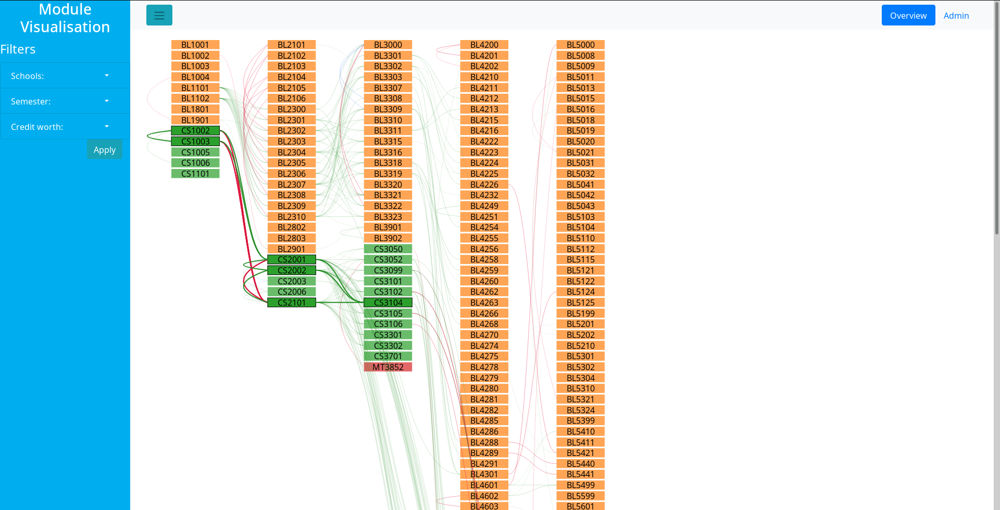

# UoStA Module Visualisation
Visualising the UG modules and requisites of the University of St Andrews.

# Project Structure
The top-level directory contains this README and the `.gitignore`. Apart from
that, the project is split into two main sub-directories:  
- `Database` -- contains all the files relevant to the database design,
  implementation, and data-population. Its sub-directories are:  
  - `dia` -- contains the raw `.dia`-files used for the ER-diagrams  
  - `initial-values` -- contains variuos SQL-scripts which populate the
    database with values that were easy to define/hardcode  
  - `initialisation-sql` -- contains the SQL-code used to create the tables,
    relations, and triggers of the database  
  - `non-schools` -- contains SQL-scripts for creating departments which
    technically no longer exist, but still offer modules  
  - `oddities` -- contains SQL-scripts to create various old or obscure modules
    that certain modern modules still reference for some reason  
  - `proc-tests` -- contains three little SQL-scripts which were manually coded,
    instead of generated by the scrapers, to test that the procedures work  
  - `procedures` -- contains the SQL-code used to create the stored procedures
    of the database  
  - `python-scripts` -- contains the web-scrapers used to populate the
    database  
  - `views` -- contains the SQL-code used to create the views of the database

- `Visualisation` -- contains all the files relevant to the visualisation
  design and implementation, e.g. the initial evaluation of the domain
  situation, and the source-code involved. Its sub-directory is:
  - `min-serv` -- contains the Flask app used as a proof-of-concept/testing
    server for the web front-end. It further contains the subdirectories:  
    - `static` -- contains the JavaScript and CSS used for the visualisation and
      the website  
    - `templates`-- contains the HTML source used for the visualisation and the
      website, as well as the HTML/JS source used for the various drafts

# Database
The underlying database was built using MariaDB. It is based on the ER-diagram
below:

# Visualisation
The visualisation is a column-based layout with each column representing a
level, e.g. 2000 or 3000. The links represent requisites and are colour-coded
based on their type:  
- pre-requisites are green  
- anti-requisites are red  
- co-requisites are blue

Currently, the modules can be filtered based on the school offering them, which
semester they run in, and/or the amount of credits they are worth. More filters
could be added in the future, e.g. filtering based on degree path/programme.

On mouseover, the links and nodes related to the node which the mouse is over
are highlighted. The idea is to show the user what they would need to take if
they wanted to do that module.

# TODO
- [x] Database layout  
- [x] Populate database with CS modules  
- [x] Popelate database with CS requisites  
- [x] Populate database with BL modules  
- [x] Populate database with BL requisites  
- [x] Very basic server  
- [x] Initial network visualisation  
- [x] Highlight paths on mouseover  
- [x] Fix highlighting (currently only does 2 levels, not all)  
- [x] Make path-calculation server-side  
- [x] Change circles to rects  
- [x] Add labels (rects --> "textboxes")  
- [x] Modify the links to match edges of boxes  
- [ ] ~~Dynamic font-size?~~  
- [x] Change opacity based on highlighting  
- [x] Change path width based on highlighting  
- [x] Filters  
  - [x] School/Subject  
  - [x] By semester  
  - [x] By credit worth  
- [x] Webpage. Try Bootstrap  
- [x] Connect the website up to the data  
- [x] Connect the filters up to the data  
  - [x] Filter the nodes/modules  
  - [x] Filter the links/requisites  
- [ ] Add a switch to change between showing requirements and consequences,
      i.e. which paths and nodes are highlighted  
  - [ ] Add a "both" option?  
- [ ] Change the filters to submit nothing if all in a category are selected  
- [ ] Modify the SVG-container based on data?...  
- [ ] ... or give it "infinite" height in some way?  
- [ ] Some sort of "module shopping cart"  
  - [ ] (More interactivity)  
- [ ] Forms for the database management stuff  
- [ ] Wire up the database management stuff to the server  
- [ ] Scrape the degree programmes (oh god...)  
- [ ] Scrape more modules (OH GOD!...)  
- [ ] The rest of this TODO-list

# Tools, Libraries, and Guides Used
## Misc.
- [Python 3.7](https://www.python.org/downloads/)

## Database
- [MariaDB 10.3.17](https://mariadb.org)  
- [Dia Diagram Editor](dia-installer.de)

## Visualisation
- [D3.js](https://d3js.org)  
- [Bootstrap 4](https://getbootstrap.com)  
  - [jQuery](https://jquery.com/)  
  - [Popper.js](https://popper.js.org/)  
- [Bootstrap Sidebar](https://bootstrapious.com/p/bootstrap-sidebar)

## Server
- [Flask 1.1.x](https://flask.palletsprojects.com/en/1.1.x/)  
  - [Flask-MySQL](https://flask-mysql.readthedocs.io/en/latest/)  
  - [Jinja 2.10.x](https://jinja.palletsprojects.com/en/2.10.x/)

# Acknowledgements
- Dr. Dharini Balasubramaniam, for creating and supervising this project  
- Dr. Ruth Letham, for help with the database design  
- Ms. Alice Lynch, for writing the base of the web-scrapers  
- Mr. Iain Carson, for help with D3 and the `returnNodes` method  
- Dr. Uta Hinrichs, for feedback and ideas concerning the visualisation
  designs

